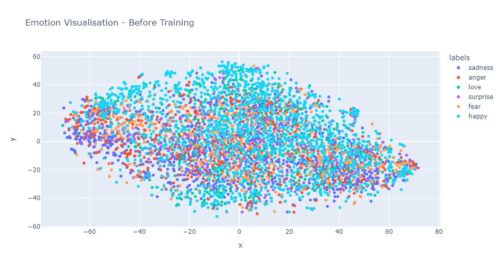
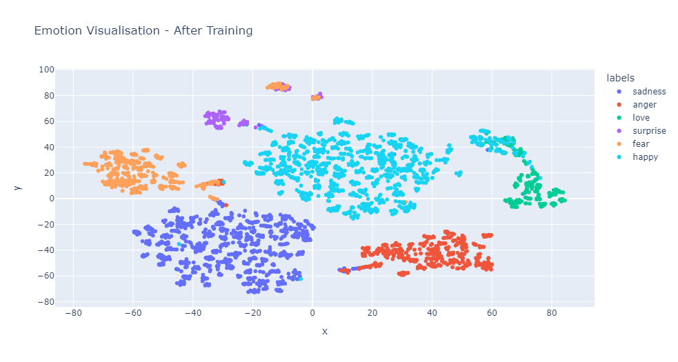

# Fine Tuning SentenceClassifier with Emotion Dataset

In this project we go compare results of fine-tuning a bert-base-uncased with Emotion dataset.

Results:

Some references:

    1 - Dataset:[emotion in text]('https://www.kaggle.com/datasets/ishantjuyal/emotions-in-text')
    2 - [Efficient embedding visualisation tsne](https://inside-machinelearning.com/en/efficient-sentences-embedding-visualization-tsne/)

Author: Matheus Rodrigues (matheusrdsgsf@gmail.com)